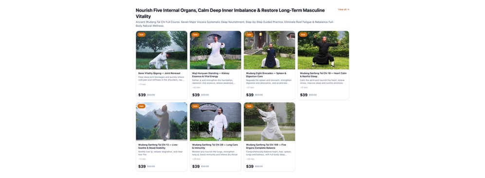
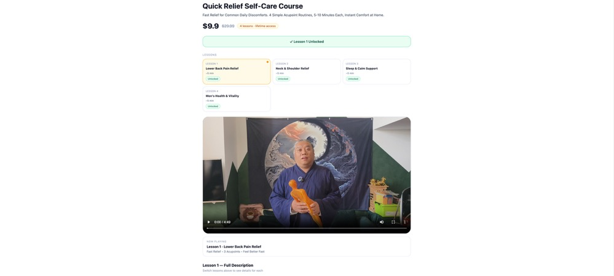

# EastCulture Wellness

A full-stack multilingual wellness education platform offering video courses in traditional Chinese medicine, Tai Chi, Qigong, Face Yoga, and holistic health practices.

## Screenshots






## Live Demo

**Frontend:** [https://eastculture.vercel.app](https://eastculture.vercel.app)  
**API:** Deployed on Vercel (separate service)

## Overview

EastCulture is a commercial wellness education platform that provides structured video courses and individual lessons in Eastern health practices. The platform supports course purchases, individual video purchases, and monthly membership subscriptions through Stripe payment integration.

**Target Users:**
- Individuals interested in traditional Chinese medicine and wellness
- Students learning Tai Chi, Qigong, and acupressure techniques
- Health practitioners seeking structured educational content

**Project Type:** Full-stack SaaS platform with payment processing and secure video delivery

## Tech Stack

### Frontend
- React with Vite
- Framer Motion (animations)
- i18next (internationalization)
- Tailwind CSS

### Backend
- Next.js (API routes)
- TypeScript
- JWT authentication
- Stripe webhooks

### Database
- Supabase (PostgreSQL)
- Row-level security policies

### Payment & Subscriptions
- Stripe Checkout
- Stripe webhook integration
- Subscription management

### Media Storage
- AWS S3 (video hosting)
- Pre-signed URLs for secure access

### Deployment
- Vercel (frontend and API)
- Environment-based configuration

### Internationalization
- 6 languages supported: English, Chinese (Simplified), Korean, Japanese, Spanish, French

## Key Features

- **Multilingual Support** — Full i18next integration with 6 language options
- **Secure Video Delivery** — AWS S3 with pre-signed URLs and purchase-based access control
- **Payment Integration** — Stripe Checkout for courses, individual videos, and memberships
- **User Authentication** — JWT-based auth with HTTP-only cookies
- **Purchase Management** — Track user purchases and unlock content dynamically
- **Responsive Design** — Mobile-first approach with Tailwind CSS
- **Admin Dashboard** — View users, orders, and revenue statistics
- **Webhook Processing** — Automated content unlocking after successful payment

## Architecture

### System Overview

```
┌─────────────┐         ┌──────────────┐         ┌─────────────┐
│   Frontend  │────────▶│   Next.js    │────────▶│  Supabase   │
│ (React/Vite)│         │   API Routes │         │ (PostgreSQL)│
└─────────────┘         └──────────────┘         └─────────────┘
                               │
                               ├──────────────────▶ Stripe API
                               │
                               └──────────────────▶ AWS S3
```

The frontend is a single-page application built with React and Vite. It communicates with the backend API for authentication, purchases, and video access. The API handles payment processing through Stripe, stores data in Supabase PostgreSQL, and serves secure video content from AWS S3 using pre-signed URLs.

**Payment Flow:** User initiates purchase → API creates Stripe Checkout session → User completes payment → Stripe webhook notifies API → API unlocks content in database → User gains access

**Video Access:** User requests video → API verifies purchase → API generates time-limited S3 URL → Frontend plays video

## Project Structure

```
EastCulture/
├── frontend/                   # React + Vite SPA
│   ├── src/
│   │   ├── App.jsx            # Main app component with routing
│   │   ├── i18n.js            # i18next configuration
│   │   ├── pages/             # Page components
│   │   └── locales/           # Translation files (en, zh, ko, ja, es, fr)
│   ├── public/                # Static assets
│   └── .env.example
│
├── api/                        # Next.js API backend
│   ├── app/
│   │   ├── api/
│   │   │   ├── auth/          # Registration, login, logout
│   │   │   ├── checkout/      # Stripe checkout creation
│   │   │   ├── webhook/       # Stripe webhook handler
│   │   │   ├── video-url/     # S3 pre-signed URL generation
│   │   │   ├── purchases/     # User purchase queries
│   │   │   └── admin/         # Admin dashboard endpoints
│   │   └── payment/           # Payment success/cancel pages
│   ├── lib/
│   │   ├── supabase.ts        # Supabase client
│   │   ├── stripe.ts          # Stripe client
│   │   └── auth.ts            # JWT utilities
│   └── .env.example
│
├── screenshots/                # Documentation images
├── docs/                       # Additional documentation
└── README.md
```

## Installation and Setup

### Prerequisites

- Node.js 18+
- Supabase account
- Stripe account
- AWS S3 bucket

### Clone Repository

```bash
git clone https://github.com/zj115/eastculture-wellness.git
cd eastculture-wellness
```

### Frontend Setup

```bash
cd frontend
npm install
cp .env.example .env.local
```

Edit `.env.local`:
```
VITE_API_BASE=http://localhost:3000
```

Run development server:
```bash
npm run dev
```

### API Setup

```bash
cd api
npm install
cp .env.example .env.local
```

Edit `.env.local` with your credentials (see Environment Variables section below).

Run development server:
```bash
npm run dev
```

### Database Setup

1. Create a Supabase project
2. Run the SQL schema from `api/supabase/schema.sql` in the SQL Editor
3. Configure Row Level Security policies as needed

### Stripe Setup

1. Create Stripe account and get API keys
2. Set up webhook endpoint pointing to `/api/webhook/stripe`
3. Subscribe to events: `checkout.session.completed`, `invoice.paid`, `customer.subscription.deleted`

### AWS S3 Setup

1. Create S3 bucket for video storage
2. Configure CORS policy to allow frontend domain
3. Upload course videos with appropriate folder structure
4. Create IAM user with S3 read permissions

## Environment Variables

### Frontend (.env.local)

```
VITE_API_BASE=https://your-api-domain.vercel.app
```

### API (.env.local)

```
NEXT_PUBLIC_SUPABASE_URL=https://xxxxx.supabase.co
SUPABASE_SERVICE_ROLE_KEY=your_supabase_service_role_key
JWT_SECRET=your_random_32_character_jwt_secret
STRIPE_SECRET_KEY=your_stripe_secret_key
STRIPE_WEBHOOK_SECRET=your_stripe_webhook_secret
AWS_REGION=ap-southeast-2
S3_BUCKET_NAME=your-s3-bucket-name
AWS_ACCESS_KEY_ID=your_aws_access_key_id
AWS_SECRET_ACCESS_KEY=your_aws_secret_access_key
NEXT_PUBLIC_FRONTEND_URL=https://your-frontend-domain.vercel.app
ADMIN_SECRET_KEY=your_admin_password
```

**Note:** Never commit `.env.local` files. Use `.env.example` as a template.

## My Contribution

I developed this full-stack platform from initial concept through deployment. My work included:

**Frontend Development:**
- Built responsive React SPA with Vite and Tailwind CSS
- Implemented i18next for 6-language support with dynamic translation loading
- Created reusable page components for courses, lessons, and user account management
- Integrated Framer Motion for smooth page transitions and animations
- Designed mobile-first responsive layouts

**Backend Development:**
- Developed Next.js API with TypeScript for type safety
- Implemented JWT authentication with HTTP-only cookies
- Built Stripe Checkout integration for courses, videos, and subscriptions
- Created webhook handler to process payment confirmations and unlock content
- Designed RESTful API endpoints for auth, purchases, and video access

**Database Design:**
- Designed PostgreSQL schema in Supabase with proper relationships
- Implemented user authentication with bcrypt password hashing
- Created purchase tracking system linking users to unlocked content
- Set up database queries with proper indexing for performance

**Payment Integration:**
- Integrated Stripe Checkout for multiple purchase types (course, video, membership)
- Implemented webhook signature verification for security
- Built automated content unlocking after successful payment
- Handled subscription lifecycle events

**Video Delivery:**
- Configured AWS S3 bucket for video storage with CORS policies
- Implemented pre-signed URL generation for secure video access
- Built access control logic based on user purchases
- Set up time-limited URLs to prevent unauthorized sharing

**Deployment:**
- Deployed frontend and API separately on Vercel
- Configured environment variables for production
- Set up custom domains and SSL certificates
- Implemented CORS policies for cross-origin requests

## Security and Privacy

- All passwords are hashed using bcrypt before storage
- JWT tokens stored in HTTP-only cookies to prevent XSS attacks
- Stripe webhook signatures verified to prevent fraudulent requests
- Video URLs are pre-signed and expire after 1 hour
- Environment variables managed outside repository
- No customer data or payment information stored in repository
- Database credentials and API keys excluded from version control

## Future Improvements

- Add video progress tracking and resume functionality
- Implement course completion certificates
- Add user reviews and ratings for courses
- Create instructor dashboard for content management
- Add email notifications for purchase confirmations
- Implement course recommendations based on user interests
- Add social sharing features for completed courses
- Optimize video streaming with adaptive bitrate

## Notes

This repository is shared for portfolio and demonstration purposes. Sensitive business information, customer data, and production credentials have been removed. Screenshots have been sanitized to protect user privacy.

The platform was developed as a commercial project and demonstrates real-world full-stack development skills including payment processing, secure media delivery, and multilingual support.

## License

This repository is shared for portfolio and demonstration purposes only. All rights reserved.
